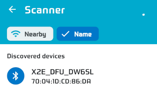
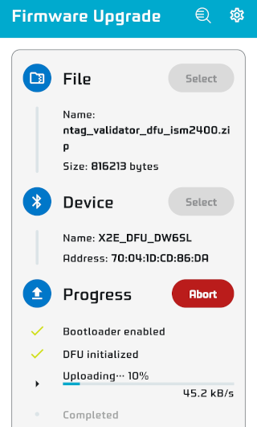
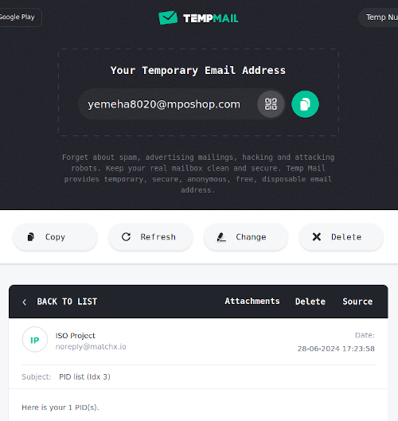
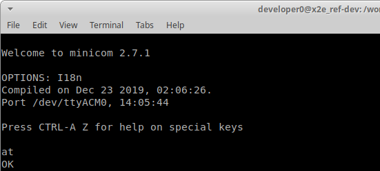
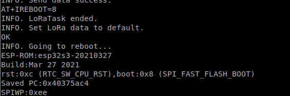

# NTAG Validator

This demonstration showcases a potential solution for verifying the location of an item using Moonchain and ChirpVM. It operates under the assumption that the target item is equipped with an NFC tag, which the Validator device will detect and authenticate by checking the tag's presence and verifying its content.

To carry out this demonstration, you will need an X2E device with an NFC reader and an OLED display, hereafter referred to as the "Validator." For detailed information on the required hardware setup, please refer to [this link](https://github.com/MatchX-GmbH/X2E-Reference-Sensor-FW/tree/main/ntag_validator).


## Moonchain Info

Contract proposals: https://github.com/MXCzkEVM/MEPs

Deployed Contract addresses:

​	MEP801: 0x070B3e2229a27CDd34126E96B2Ce65c63BD1A5CE

​	MEP802: 0x28479D68cD3ef5661BDB7505EFD1712D5D0951F6

​	MEP803: 0xBFc77Ee5959699eC4171891b625D6EccdC9e00cD

MEP804 example: https://github.com/MXCzkEVM/iso-sensor-token-example


The commands in this document use the wallet address `0xa2d9E584F4cF0167d283dB6EB4922082269B6bB7` as an example. You can replace this address with your own wallet address and private key. Please ensure you have MXC to cover gas and other transaction fees.

Private key:

    318dee0c207c20f4767e342a52e876b816379334a53277773c783b0e9348d368


## Prepare an NTAG Validator

If your X2E board is currently running different firmware, please follow the steps below to update the firmware for this tutorial.

1. Download the mobile APP tool (Nordic DFU) for firmware update.

   https://play.google.com/store/apps/details?id=no.nordicsemi.android.dfu&hl=en&gl=US

   https://apps.apple.com/tt/app/nrf-device-firmware-update/id1624454660  (require iOS 16)

2. Copy the firmware binary file `ntag_validator_dfu_ism2400.zip` to you mobile phone. 
   (Important: Place the file in the download folder, otherwise it may not be recognized correctly)

3. Start the DFU App and select the firmware binary file.

   

4. Tap the Device's "Select" button to start scanning for BLE devices.

5. Press and hold the "USER" button of X2E board for 5s to start the DFU routine. The LED will become fast blinking when DFU started and it will shows up on the App.

   

6. Select the X2E board on the list as the target device.

   

7. Tap "Start" button to start the firmware upgrade.

   

8. Wait until the upgrade process complete.


## Purchase a Provision ID (PID)

Find a temporary email service provider to get the email address for receiving the PID. As the email address will be on the moonchain, using a temporary email address can prevent your private email address showing to public on the chain.


Check the device profile (from MEP803) that we will be using. It needs to match the firmware of the X2E board. We will be using an existing ISM2400 profile, with the index set to 4.

```
cast call 0xBFc77Ee5959699eC4171891b625D6EccdC9e00cD "deviceProfileList(uint256) (uint256,string,address,string,bool,uint256)" 4 --rpc-url https://geneva-rpc.moonchain.com --private-key 318dee0c207c20f4767e342a52e876b816379334a53277773c783b0e9348d368
```

The response will be similar to the following.

```
4
NTAG Validator - ISM2400
0xa2d9E584F4cF0167d283dB6EB4922082269B6bB7
https://api.github.com/repos/MatchX-GmbH/iso-device-profile/contents/matchx/ntag_validator_ism2400.json
true
0
```


Check the unit price of a PID from MEP802.

```
cast call 0x28479D68cD3ef5661BDB7505EFD1712D5D0951F6 "pidUnitPrice() (uint256)" --rpc-url https://geneva-rpc.moonchain.com --private-key 318dee0c207c20f4767e342a52e876b816379334a53277773c783b0e9348d368
```

The response will be `123450000000000000000` wei, means 123.45 MXC.


Please replace the email address with your own and send the following command to purchase one PID via MEP802.

```
cast send 0x28479D68cD3ef5661BDB7505EFD1712D5D0951F6 "producePid(string,uint256,uint256)" "yemeha8020@mposhop.com" 1 4 --rpc-url https://geneva-rpc.moonchain.com --private-key 318dee0c207c20f4767e342a52e876b816379334a53277773c783b0e9348d368 --value 123450000000000000000
```

Wait for few minutes after the transaction done, you will receive a email and attached with the PID csv file.



Please read the PID `OIASFGZ4X2C7H4DYH5A5QUMJ` from the attached file and use it to set up the Validator. You will also need the pidZkevmHash (5th column) when interacting with Moonchain.


The commands in the later examples will use the following `pidZkevmHash`.

```
0xcdb3fe0f12bb180120a3deea007c44f81315fdec403fd24580744c584a9989ae
```


## Setup the Validator

Connect the Validator to your computer using a USB Type-C cable. Next, launch a serial terminal program like `minicom` on Linux or `PuTTY` on Windows, and establish a connection with the Validator. Use the serial settings `115200 8N1`.

```
minicom -b 115200 -8  -D /dev/ttyACM0 -o
```

Then send a "AT" command to test the connection. If the connection is correct, the Validator will reply a "OK".



Send the following command at the serial terminal program to change the PID of the Validator. *Replace the PID to the one got from previous steps.* You will get a OK if success.

```
AT+CQRCODE={"PID":"OIASFGZ4X2C7H4DYH5A5QUMJ","B":"MatchX","M":"X2E","V":"1.3"}
```

Clear all data and reboot.

```
AT+IREBOOT=8
```



After rebooting, the Validator will wait for the user to press BUTTON1 to continue with the provisioning process. Please place the hardware onto a blank NTAG. During this process, the NTAG will be initialized and prepared for validation later.

*If you need to reset an NTAG, please refer to the [Reset_NTAG.md](./Reset_NTAG.md).*


Press BUTTON1 and wait for the Validator to complete the provisioning process. Once finished, it will begin joining the network and transmitting data.

*If this doesn't occur within 6 minutes, please check the status of your NEO miner to ensure it is running properly.*


After that, the Validator will continue sending data to ChirpVM, allowing you to process the data further.


## Mint the sensor NFT for the Validator

Check the price for minting a sensor NFT.

```
cast call 0x28479D68cD3ef5661BDB7505EFD1712D5D0951F6 "priceInfoList(uint256) (uint256,uint,bool)" 0 --rpc-url https://geneva-rpc.moonchain.com --private-key 318dee0c207c20f4767e342a52e876b816379334a53277773c783b0e9348d368
```

The response will similar as below. The first line is the price. 9876500000000000000 equal to 9.8765 MXC.

```
9876500000000000000
0
true
```


Mint the NFT by replacing `0xf6d4bd...` with the pidZkevmHash you received for your Validator.

```
cast send 0x28479D68cD3ef5661BDB7505EFD1712D5D0951F6 "mintSensorNFT(uint256,uint256,string)" 0xcdb3fe0f12bb180120a3deea007c44f81315fdec403fd24580744c584a9989ae 0 "https://global.matchx.io/iso/x2e/x2e_ref_sensor.jpeg" --rpc-url https://geneva-rpc.moonchain.com --private-key 318dee0c207c20f4767e342a52e876b816379334a53277773c783b0e9348d368 --value 9876500000000000000
```

After Sensor NFT minted, you are ready to send data to the X2E board via Moonchain.


To repeat the minting process, you must first burn the Sensor NFT.

```
cast send 0x28479D68cD3ef5661BDB7505EFD1712D5D0951F6 "burnSensorNFT(uint256)" 0xcdb3fe0f12bb180120a3deea007c44f81315fdec403fd24580744c584a9989ae --rpc-url https://geneva-rpc.moonchain.com --private-key 318dee0c207c20f4767e342a52e876b816379334a53277773c783b0e9348d368
```


## Get the data

Using the following command, we will get the latest data from ChirpVM.

```
curl -s https://chirpvm.matchx.io/iso/api/sensorData/0xcdb3fe0f12bb180120a3deea007c44f81315fdec403fd24580744c584a9989ae/last/mean | jq
```


The object with `validated` field is the NTAG validation result. A `1` means the NTAG is well verified. The `gateway` field is the identification of the miner that handled the data from the Validator.


## Query the location information

Let's take a look on a real miner information that could found on the Moonchain.

```
NEO35fbac8fe38fd8d6e6c2ca8e04b316596136346c5d85e22a485d2ed8feff9139
```

Use the miner ID to get the token ID.

```
cast call 0x8Ff08F39B1F4Ad7dc42E6D63fd25AeE47EA801Ce "getTokenId(string) (uint256)" NEO35fbac8fe38fd8d6e6c2ca8e04b316596136346c5d85e22a485d2ed8feff9139 --rpc-url https://rpc.mxc.com
```

The result will be `7777`.

We can find its token at explorer here: 

https://explorer.moonchain.com/token/0x8Ff08F39B1F4Ad7dc42E6D63fd25AeE47EA801Ce/instance/7777

Get the detail of the miner.

```
curl -s https://mining-api.matchx.io/mep2542/getMEP1004TokenDetail?tokenId=7777 | jq
```


The `mep1002TokenID` is the geo-hexagon ID of the miner.  Removing the leading `0x` and the rest is the decimal value of the ID.

Using the python script to get the centre point of the hexagon in lat/lng value.

*You may need to install the python and the H3 lib (`pip install h3`).*

```
python3 scripts/h3_info.py 609623381666430975
```


## Conclusion

By checking the `validated` field of the Validator and querying the location information of the miner, this data can be used as a location proof for the targeted object. This serves as a foundation for further developing applications based on the obtained location verification.
